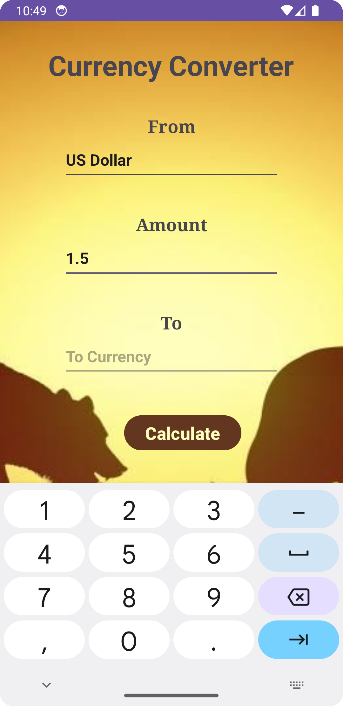

<h1>Currency Converter App</h1>
<a href="https://github.com/7abhisheknn"><h3>Github</h3></a>
<a href="https://www.linkedin.com/in/abhisheknn/"><h3>LinkedIn</h3></a>

    An Android App to Convert Currency.
    Capable of converting from any currency to any currency.

<h2>HomePage</h2>
<table>
    <tr>
        <td>Home Page</td>
    </tr>
    <tr>
        <td></td>
    </tr>
</table>

<h2>Input Values</h2>
<table>
    <tr>
        <td>From Currency</td>
        <td>Amount</td>
        <td>To Currency</td>
    </tr>
    <tr>
        <td></td>
        <td></td>
        <td></td>
    </tr>
</table>

<h2>Output</h2>
<table>
    <tr>
        <td>Output</td>
    </tr>
    <tr>        
        <td></td>
    </tr>
</table>

<h1>Thank You</h1>