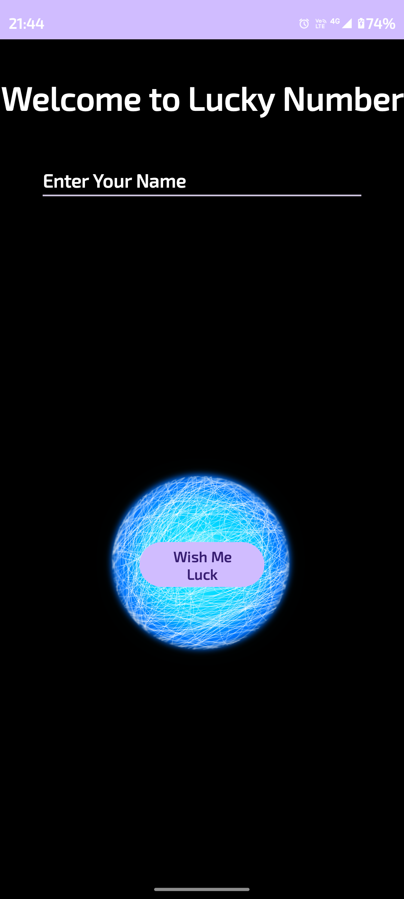
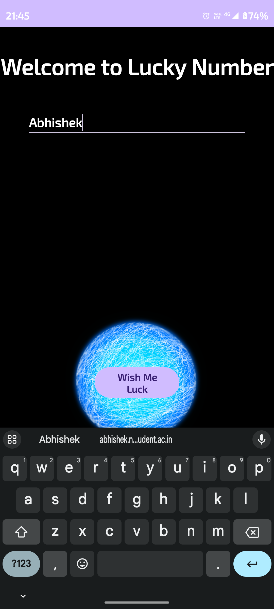
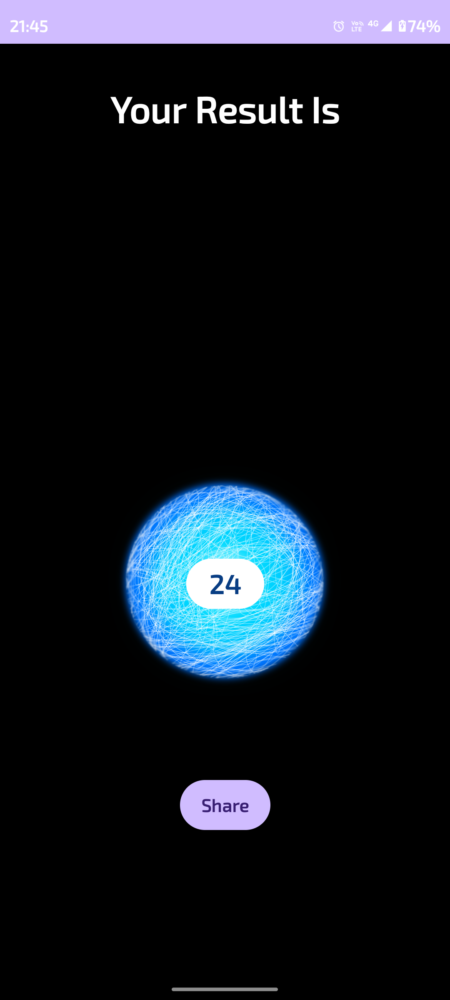
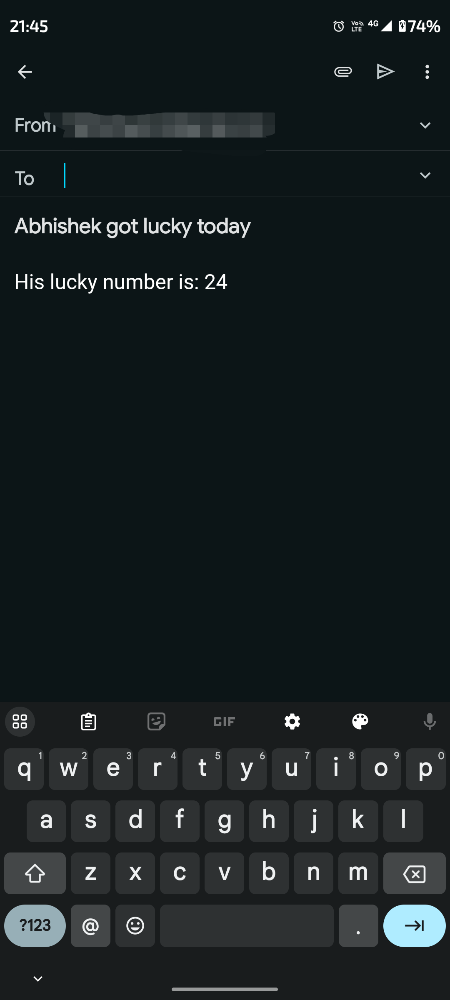

<h1>Lucky Number App</h1>
<a href="https://github.com/7abhisheknn"><h3>Github</h3></a>
<a href="https://www.linkedin.com/in/abhisheknn/"><h3>LinkedIn</h3></a>

    An Android App to share lucky number.
    Capable of generating lucky number (random number) and share with any app.

<h2>HomePage</h2>
<table>
    <tr>
        <td>Home Page</td>
    </tr>
    <tr>
        <td></td>
    </tr>
</table>

<h2>Intermediate Screens</h2>
<table>
    <tr>
        <td>Name type</td>
        <td>Lucky Number Shown</td>
    </tr>
    <tr>
        <td></td>
        <td></td>
    </tr>
</table>

<h2>Final Sharing</h2>
<table>
    <tr>
        <td>Sharing as email</td>
    </tr>
    <tr>        
        <td></td>
    </tr>
</table>

<h1>Thank You</h1>
